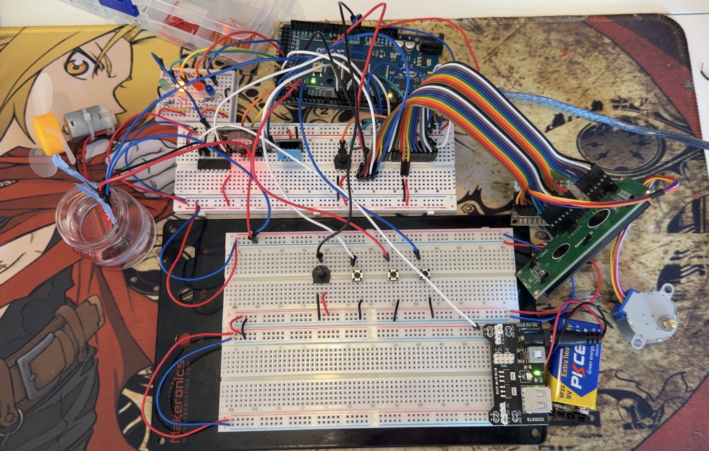
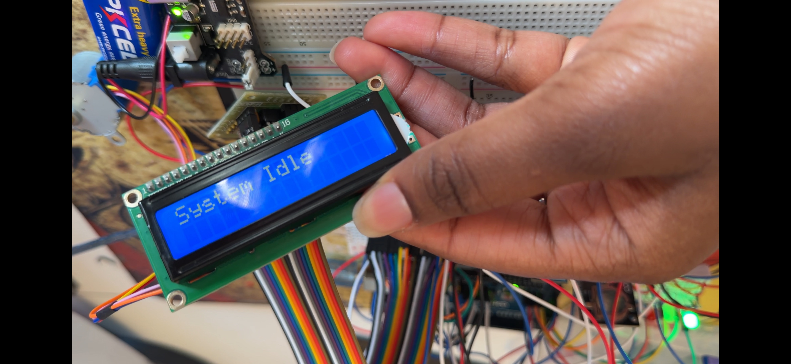
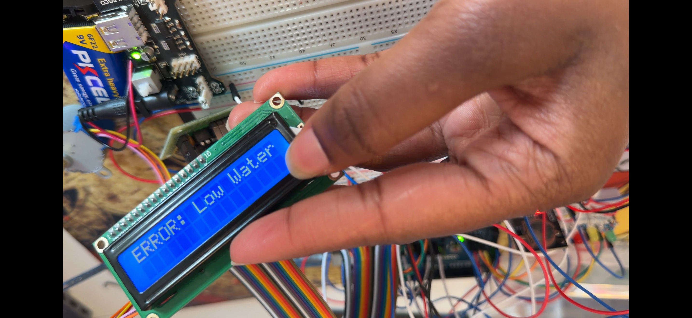

# CPE301_FinalProject
## Author
Bousso Seck  
**Course:** CPE 301 – Embedded Systems Design  
**University:** University of Nevada, Reno
**Prject:**  Swamp Cooler (Evaporative Cooling System)

**Team 44:** Bousso Seck

### 1. Project Description
The objective of this project was to design and implement a functional evaporative cooling system (swamp cooler), using the Arduino Mega 2560 and components provided in the CPE 301 laboratory kit (ELEGOO Mega R3). Evaporative cooling systems are energy-efficient alternatives to traditional air conditioning systems in dry climates, operating by pulling air through water-saturated material to reduce temperature via evaporation.
This project integrates sensors, actuators, and user inputs into a real-time embedded system controlled by a finite state machine. The system monitors temperature, humidity, and water level, controls a fan motor and vent position, and provides feedback to the user through LEDs, an LCD display, and serial output with real-time timestamps.
### 2. Hardware
- Arduino Mega 2560:
Acts as the main controller, handling sensor input, state logic, actuator control, and communication.
- DHT11 Temperature and Humidity Sensor:
Used to measure ambient temperature and humidity. Readings are taken periodically and displayed on the LCD.
- Water Level Sensor:
Monitors the water reservoir level. 
- LCD 16x2 Display:
Provides user feedback including system status, temperature, humidity, and error messages.
- RTC Module (DS1307):
Records the date and time of all state transitions, fan activity, and vent position changes. 
- DC Fan Motor with Motor Driver:
Controls airflow through the system. The motor is powered by an external supply and controlled via PWM, as allowed by project specifications.
- Stepper Motor with ULN2003 Driver:
Controls the vent direction. Vent position is adjusted using a potentiometer and movement is logged with timestamps.
- Push Buttons:
Used for start, stop, and reset inputs. The start button is implemented using an interrupt service routine.
- LED Indicators:
Provides a visual indication of the current system state using color-coded LEDs.

All the components used are available in the ELEGOO Mega R3 Project Starter kit (optional/ recommended: female/male extension jumpers).
Link: https://a.co/d/3gT42I3

### 3. System Overview & Software Design
The swamp cooler system is built around the Arduino Mega 2560 and consists of multiple subsystems working together. Sensor data is continuously collected and processed to determine system behavior. Actuators respond based on system state, and user interaction is handled through hardware interrupts. The design follows all project constraints, including restricted use of Arduino libraries and safe power management.
Separate power supplies are used for logic and motors to prevent damage to the microcontroller. All motors are driven through appropriate driver circuits, and all system grounds are shared to maintain stable operation.
The software is written in C/C++ for the Arduino platform. Direct register manipulation is used for GPIO, ADC, UART, and timer functionality. Arduino libraries are only used where explicitly permitted, including the LCD, RTC, DHT11, and stepper motor libraries.
Blocking functions such as delay() are not used in the final implementation. Timing requirements are met using the millis()function to allow continuous system operation. Serial communication is handled through UART registers rather than the Arduino Serial library.

### 4. Operation Description
The system operates using four distinct states: Disabled, Idle, Running, and Error. State transitions are triggered by user input or sensor conditions, and all transitions are logged with a timestamp using the real-time clock module.
**Disabled State:
The system starts in the Disabled state. In this state, the fan motor is off, no sensor monitoring occurs, and the yellow LED is illuminated. The start button is monitored using an interrupt service routine. Pressing the start button transitions the system to the Idle state.
**Idle State:**
In the Idle state, the green LED is on and the system actively monitors temperature, humidity, and water level. Sensor values are displayed on the LCD once per minute using a non-blocking timing method. The vent position can be adjusted using a potentiometer connected to a stepper motor. If the temperature exceeds a predefined threshold, the system transitions to the Running state.
**Running State:**
In the Running state, the blue LED is illuminated and the fan motor is activated. The system continues monitoring temperature and water level. If the temperature drops below the threshold, the system returns to the Idle state. If the water level drops below the minimum threshold, the system transitions immediately to the Error state.
**Error State:**
In the Error state, the fan motor is shut off regardless of temperature, the red LED is illuminated, and an error message indicating low water level is displayed on the LCD. The system remains in this state until the reset button is pressed and the water level is confirmed to be above the threshold, at which point the system returns to the Idle state.

### 5. Testing and Validation
Each subsystem was tested independently during development before full system integration. LEDs were tested to verify correct polarity and port mapping. Buttons were tested using serial output to confirm correct interrupt behavior. Sensors were validated individually under controlled conditions, and actuators were tested with standalone sketches to confirm proper operation and power handling.
After individual validation, the system was integrated and tested as a whole. All state transitions were verified, safety conditions were enforced, and the system operated reliably during extended testing and final demonstration.
###6. Circuit Images
The following figures document the construction and hardware layout of the swamp cooler embedded system developed for this project.

**Figure 1:** Full circuit.

**Figure 2:** Different angel of full circuit.

**Figure 3:** Close-up of the top half of the circuit.

**Figure 4:** Close-up of bottom half of the circuit.

**Figure 5:**  Disabled State, yellow LED is ON.

**Figure 6:** Idle State, green LED is ON.

**Figure 7:** Error State - Low Water.

**Figure 8:** Fan is working.

### 7. Schematic / Block Diagram
This diagram provides a high-level representation of the connections between the Arduino Mega and all system components.

### 8. Conclusion
This project demonstrates the design and partial implementation of an embedded system based on a finite state machine approach. The swamp cooler integrates multiple sensors, actuators, and user inputs, and follows the required hardware safety practices and software constraints outlined in the course specifications. Each subsystem was implemented and validated individually, and the overall design reflects the embedded systems concepts developed throughout the course, including state-based control, register-level programming, and safe peripheral integration.

### 9. Repository and Demonstration Links
   
GitHub Repository:
https://github.com/boussuh/CPE301_FinalProject/
Demonstration Video:
https://youtu.be/FYRoWTqg6zE

#### References

Arduino Mega 2560 Datasheet
DHT11 Sensor Datasheet
DS1307 RTC Datasheet
ULN2003 Stepper Motor Driver Datasheet
L293D Motor Driver Datasheet

